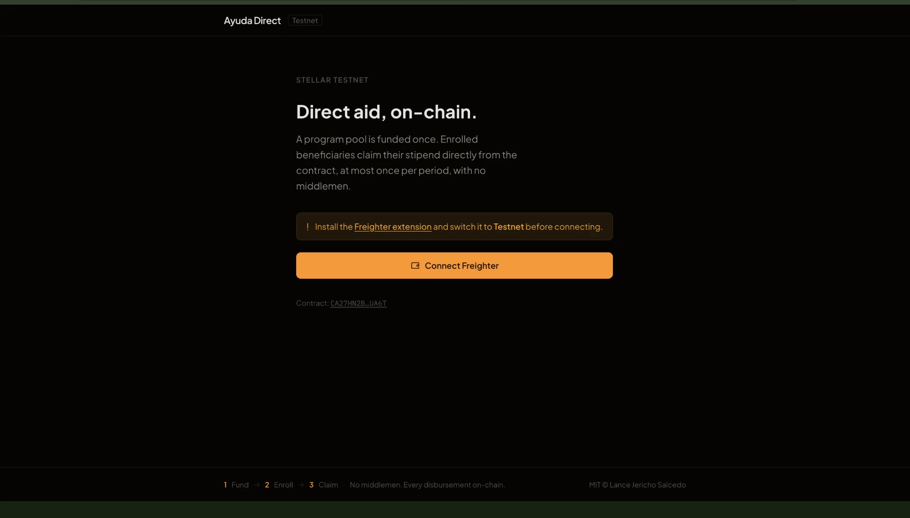
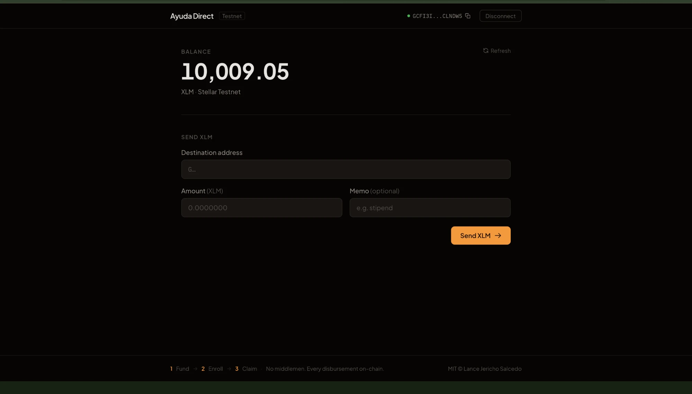
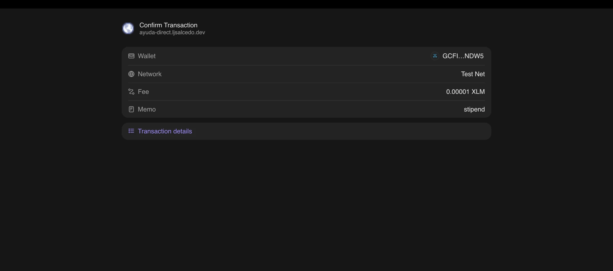
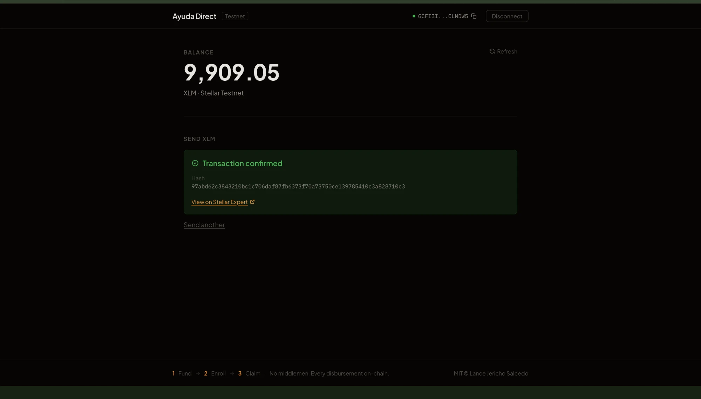
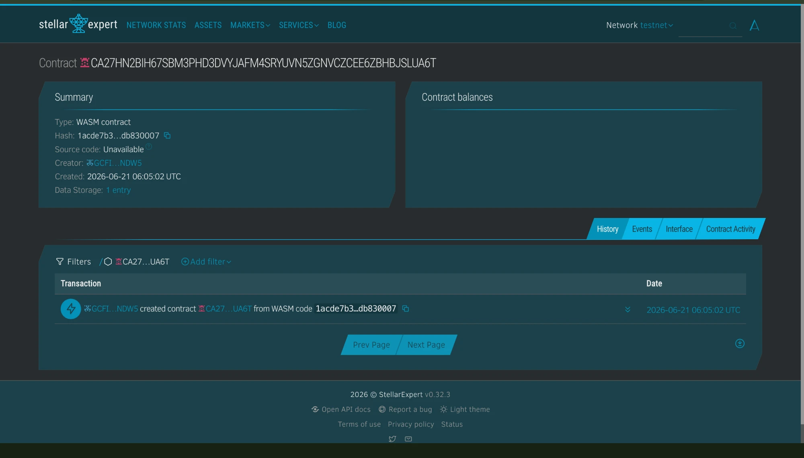

# Ayuda Direct

> Direct, leak-proof cash assistance on Stellar. Beneficiaries pull their own stipend — no middlemen, every claim on-chain.

## Project Description

Ayuda Direct is a Soroban smart contract that turns government or NGO cash-assistance programs into a self-serve, on-chain payout system. A funding source loads a token pool once; enrolled beneficiaries then claim their own fixed stipend directly from the contract, at most once per a configurable period, with the ledger's timestamp doing the rate-limiting instead of a human approver. The result is a program where every fund, enrollment, and claim is a verifiable on-chain event, and no single party ever holds or routes the cash between the funder and the recipient.

## Problem

Government and NGO cash aid ("ayuda") in the Philippines is distributed through slow, leak-prone channels. Recipients queue for hours or wait weeks, and value is lost to middlemen between the funding source and the family. The people who most need predictable support get the least predictable delivery.

## Solution

A program is funded once, on-chain. The admin enrolls beneficiaries, and each enrolled person *pulls* a fixed stipend themselves — at most once per period (e.g. weekly or monthly), enforced by the ledger clock. The pull model removes the operator from every individual payout: no manual batch runs to skim, no discretionary delays.

## Stellar features used

- **Soroban smart contract** enforces the eligibility schedule (`require now >= last_claim + period`) using the on-chain timestamp.
- **Stellar Asset Contract (SAC) token** for real stipend transfers in USDC or any issued asset.
- **`require_auth`** so each beneficiary signs for their own claim — the contract never moves funds on someone's behalf without their key.
- **Contract events** (`fund`, `enroll`, `claim`) provide a public, tamper-evident disbursement log.

## Core feature (MVP)

`fund -> enroll -> claim`, rate-limited by period, with `program_balance`, `next_claim_time`, and `is_enrolled` views. Two-minute demo: fund the pool, enroll a beneficiary, claim once (succeeds), claim again immediately (reverts: "claim too soon"), advance the clock, claim again (succeeds).

## Project Vision

Ayuda Direct envisions a Philippines where cash assistance reaches the people who qualify for it as reliably as a bank transfer — funded transparently, claimed directly, and auditable by anyone, without an operator standing between the budget and the beneficiary.

## Future Scope

Plug into a real LGU/DSWD funding wallet and a simple mobile front end with cash-out via local on/off ramps. Add conditional triggers (proof-of-attendance, oracle-fed eligibility) so conditional cash-transfer programs run on the same rails. Other planned improvements:

- Per-beneficiary stipend tiers instead of one fixed amount for the whole program.
- A pause/resume switch for the admin to halt claims during a funding gap without redeploying.
- Batch enrollment so an operator can onboard a barangay's full beneficiary list in one transaction.
- An optional appeal/override path for the admin to issue a one-time early claim in emergencies.

---

## Screenshots

**Landing page — connect your wallet**


**Wallet connected — balance displayed**


**Send form filled — Freighter signing prompt**


**Transaction confirmed — result shown on-chain**


---

## Getting Started

### Frontend (Freighter wallet + XLM transfers)

**Prerequisites:** Node.js ≥ 18, npm, and the [Freighter browser extension](https://freighter.app) set to **Testnet**.

```bash
cd frontend
npm install
npm run dev        # opens http://localhost:5173
```

Connect Freighter, fund your Testnet account at [friendbot.stellar.org](https://friendbot.stellar.org), then send XLM directly from the UI.

### Smart contract (Soroban)

## Prerequisites

- Rust toolchain. **Verified on `rustc` 1.75 with `soroban-sdk` 21.7.7** (the pinned `Cargo.lock` reproduces this exactly). Any newer Rust also works.
- `wasm32-unknown-unknown` target: `rustup target add wasm32-unknown-unknown`
- Stellar CLI (formerly the `soroban` CLI): `cargo install --locked stellar-cli`

## Build

```bash
stellar contract build      # legacy alias: soroban contract build
```

Output: `target/wasm32-unknown-unknown/release/ayuda_direct.wasm`.

## Test

```bash
cargo test
```

Five tests cover the happy path, a too-soon double claim revert, the next-claim schedule state, a not-enrolled revert, and a successful second claim after the period elapses.

## Deploy to testnet

```bash
stellar keys generate gov --network testnet --fund

CONTRACT=$(stellar contract deploy \
  --wasm target/wasm32-unknown-unknown/release/ayuda_direct.wasm \
  --source gov --network testnet)

# stipend = 5 USDC (7-decimal), period = 1 week (604800 s)
stellar contract invoke --id $CONTRACT --source gov --network testnet \
  -- initialize --admin <ADMIN_ADDRESS> --token <TOKEN_ADDRESS> \
     --stipend 50000000 --period 604800
```

## Contract Details

- **Network:** Stellar Testnet
- **Contract ID:** `CA27HN2BIH67SBM3PHD3DVYJAFM4SRYUVN5ZGNVCZCEE6ZBHBJSLUA6T`
- **Explorer link:** https://stellar.expert/explorer/testnet/contract/CA27HN2BIH67SBM3PHD3DVYJAFM4SRYUVN5ZGNVCZCEE6ZBHBJSLUA6T
- **Block explorer screenshot:**

  

## Sample invocation

```bash
# Sponsor funds the program with 1000 USDC
stellar contract invoke --id $CONTRACT --source gov --network testnet \
  -- fund --from <SPONSOR_ADDRESS> --amount 10000000000

# Enroll a beneficiary
stellar contract invoke --id $CONTRACT --source gov --network testnet \
  -- enroll --beneficiary <BENEFICIARY_ADDRESS>

# Beneficiary claims their stipend (signs as themselves)
stellar contract invoke --id $CONTRACT --source beneficiary --network testnet \
  -- claim --beneficiary <BENEFICIARY_ADDRESS>

# When can they claim next?
stellar contract invoke --id $CONTRACT --source gov --network testnet \
  -- next_claim_time --who <BENEFICIARY_ADDRESS>
```

## Note on SDK version

Pinned and verified on `soroban-sdk` 21.7.7. To move to `soroban-sdk` 22, use Rust ≥ 1.81 and swap the test call `env.register_contract(None, AyudaDirect)` for `env.register(AyudaDirect, ())`; the contract logic is unchanged.

## License

MIT © Lance Jericho Salcedo